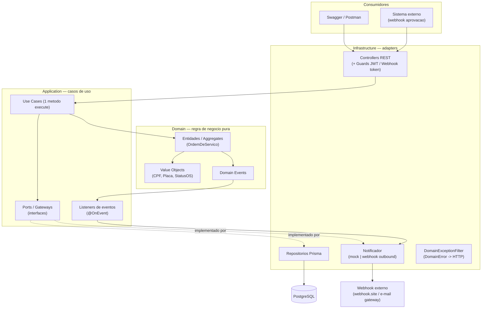
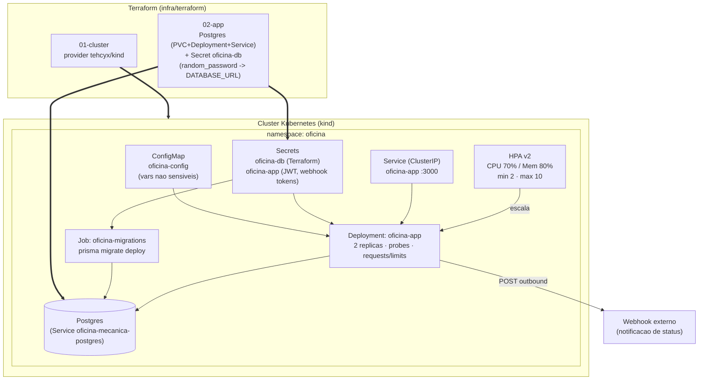
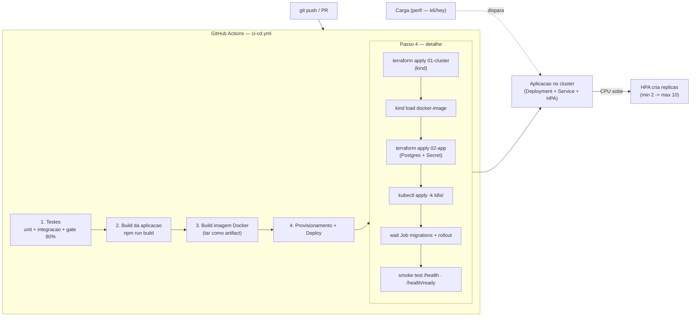

# Arquitetura — Fase 2

Desenho da arquitetura da solução evoluída na Fase 2: **componentes da aplicação**,
**infraestrutura provisionada** e **fluxo de deploy**. Os diagramas estão em
[Mermaid](https://mermaid.js.org/) e são renderizados diretamente pelo GitHub.

> Para o PDF de entrega, exporte estes diagramas como imagem (por exemplo
> `npx -p @mermaid-js/mermaid-cli mmdc -i docs/arquitetura/arquitetura-fase2.md -o docs/arquitetura/diagrama.png`).

---

## 1. Componentes da aplicação (Clean Architecture + DDD)

A aplicação é um monólito NestJS organizado por **bounded contexts**, cada um em
três camadas com dependências apontando **para dentro** (Infra → Application →
Domain). O domínio não conhece framework nem ORM; a regra de dependência é
garantida por teste automatizado (`src/shared/architecture.spec.ts`).

**Bounded contexts:** `Atendimento` (Cliente, Veiculo, OrdemDeServico — aggregate root),
`Catalogo` (Servico), `Estoque` (Produto), `Autenticacao` (Usuario/JWT) e
`Notificacao`. A comunicação entre contextos usa *ports* read-only de
anti-corrupção (`application/gateways/consulta.gateways.ts`).

---

## 2. Infraestrutura provisionada (Terraform + Kubernetes)

O provisionamento é feito em **dois estágios de Terraform**. O estágio `01-cluster`
cria o cluster Kubernetes (kind, local — nome `oficina-local`) e o `02-app` cria o
banco de dados e o Secret com a `DATABASE_URL` (senha gerada por `random_password`).
Os manifestos da aplicação são aplicados via `kubectl apply -k k8s/`.

> Para subir todo esse fluxo local em um comando (terraform → build → `kind load`
> → `kubectl apply -k k8s/` → migrations → seeds → metrics-server), use o atalho
> [`scripts/local-k8s-up.sh`](../../scripts/local-k8s-up.sh).

### Recursos criados pelo Terraform

| Estágio | Recurso | Descrição |
|---|---|---|
| `01-cluster` | `kind_cluster` | Cluster Kubernetes local (control-plane + workers) |
| `02-app` | `kubernetes_namespace` | Namespace da aplicação |
| `02-app` | `kubernetes_persistent_volume_claim` + `kubernetes_deployment` + `kubernetes_service` | Banco PostgreSQL (`postgres:16-alpine`) dentro do cluster |
| `02-app` | `random_password` | Senha do banco gerada aleatoriamente |
| `02-app` | `kubernetes_secret` (`oficina-db`) | `DATABASE_URL` consumida pela app e pelo Job de migrations |

> O modo **cloud** (EKS + RDS) é suportado por variável, mantendo o mesmo
> contrato de `DATABASE_URL` via Secret. Detalhes em
> [`infra/terraform/README.md`](../../infra/terraform/README.md).

---

## 3. Fluxo de deploy (CI/CD)

O pipeline (`.github/workflows/ci-cd.yml`) prova o deploy ponta-a-ponta criando um
cluster kind **efêmero** no runner — um cluster Kubernetes real, atendendo
literalmente ao requisito "deploy no cluster Kubernetes".

O diretório [`perf/`](../../perf) contém a suíte de carga/estresse/spike/soak e o
teste de escalabilidade que valida o HPA reagindo à carga (workflows
`perf-*.yml`, sob demanda).
