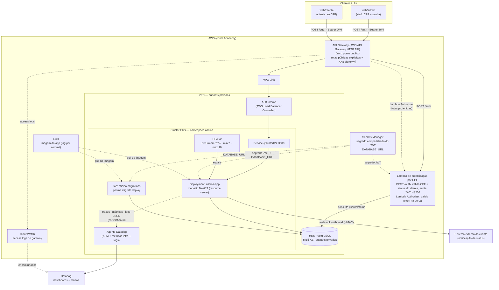
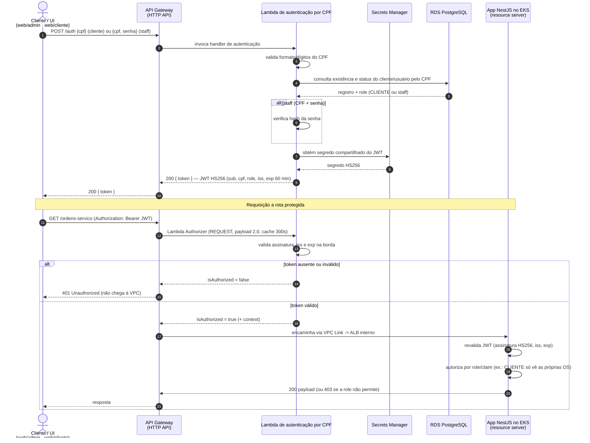
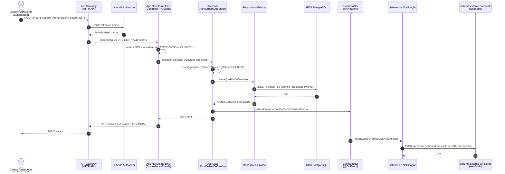
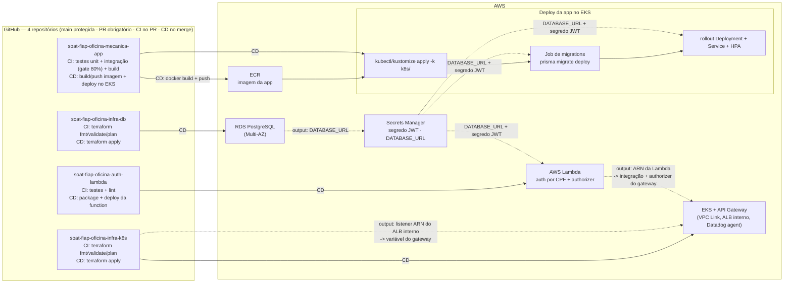

# Arquitetura — Fase 3

Desenho da arquitetura da solução evoluída na Fase 3 para a nuvem AWS:
**componentes (visão de nuvem)**, **sequência de autenticação por CPF**,
**sequência de abertura de OS** e **fluxo de deploy dos 4 repositórios**. Os
diagramas estão em [Mermaid](https://mermaid.js.org/) e são renderizados
diretamente pelo GitHub. A Fase 3 é uma **evolução** da
[Arquitetura da Fase 2](arquitetura-fase2.md): a organização interna do
monólito (Clean Architecture + DDD) permanece a mesma; muda a infraestrutura
que o hospeda e a forma de autenticar.

> Para o PDF de entrega, exporte estes diagramas como imagem (por exemplo
> `npx -p @mermaid-js/mermaid-cli mmdc -i docs/arquitetura/arquitetura-fase3.md -o docs/arquitetura/arquitetura-fase3.png`).

---

## 1. Diagrama de Componentes (visão de nuvem)

O **API Gateway é o único ponto público**. As UIs autenticam via `POST /auth`
(Lambda de CPF) e chamam as rotas protegidas com `Authorization: Bearer`; o
gateway valida o token na borda com a mesma Lambda atuando como **Lambda
Authorizer** e encaminha ao monólito por **VPC Link → ALB interno**. O
monólito roda no **EKS** com HPA e lê `DATABASE_URL`/segredo do JWT do
**Secrets Manager**; o banco é **RDS PostgreSQL Multi-AZ** em subnets
privadas. A observabilidade é feita pelo **agente Datadog** no cluster
(APM + infra + logs) com dashboards/alertas na plataforma.

---

## 2. Diagrama de Sequência — Autenticação

A **Lambda é o único emissor de JWT** (HS256, segredo compartilhado via
Secrets Manager; claims `sub`, `cpf`, `role`, `iss`, `exp` = 60 min). O
cliente autentica **só com CPF**; o staff usa **CPF + senha** na mesma Lambda.
O token é validado **duas vezes de propósito** — na borda (Lambda Authorizer)
e no app (resource server, que ainda autoriza por role/claim) — defesa em
profundidade.

---

## 3. Diagrama de Sequência — Abertura de OS

Entrada **REST síncrona via gateway**; dentro do monólito os bounded contexts
conversam por **eventos in-process (`@OnEvent`)**; a saída para o cliente é
um **webhook outbound com HMAC** emitido pelo contexto de Notificação.

---

## 4. Fluxo de deploy (CI/CD dos 4 repositórios)

Na Fase 2 havia um **pipeline único** que criava um cluster kind efêmero no
runner. Na Fase 3 a solução está segregada em **4 repositórios independentes**,
todos com `main` protegida (PR obrigatório), **CI em todo PR** (testes/lint no
código; `fmt`/`validate`/`plan` no Terraform) e **CD no merge à `main`**
(deploy automático / `apply`). Credenciais AWS ficam apenas em GitHub Actions
Secrets; os **contratos entre repos viajam por outputs/Secrets**.

---

## 5. Legenda / racional

Cada componente ou decisão dos diagramas acima tem origem em uma RFC
([US-F3-DOC-01](../user-stories/f3-doc-01-rfcs.md)) ou ADR
([US-F3-DOC-02](../user-stories/f3-doc-02-adrs.md)):

| Componente / decisão | Diagramas | Origem |
|---|---|---|
| AWS como nuvem (conta Academy) | 1, 4 | [RFC-0001](rfcs/RFC-0001-escolha-da-nuvem.md) |
| RDS PostgreSQL Multi-AZ em subnets privadas; `DATABASE_URL` via Secrets Manager; migrations Prisma apontando para o RDS | 1, 3, 4 | [RFC-0002](rfcs/RFC-0002-escolha-do-banco.md) · [Banco de dados](banco-de-dados.md) |
| Lambda como único emissor de JWT (cliente só CPF, staff CPF + senha); HS256 com segredo compartilhado; claims `sub`/`cpf`/`role`/`iss`/`exp` | 1, 2 | [RFC-0003](rfcs/RFC-0003-estrategia-de-autenticacao.md) |
| REST síncrono via gateway; eventos in-process `@OnEvent` entre bounded contexts; webhook outbound com HMAC; sem broker nesta fase | 1, 3 | [ADR-0001](adr/ADR-0001-padrao-de-comunicacao.md) |
| HPA por CPU/memória 70%, `minReplicas 2` / `maxReplicas 10`, metrics-server | 1, 4 | [ADR-0002](adr/ADR-0002-hpa-autoescalonamento.md) |
| Monólito como resource server (valida assinatura/`iss`/`exp`, autoriza por role/claim); dupla validação borda + app | 1, 2, 3 | [ADR-0003](adr/ADR-0003-app-resource-server.md) |
| Datadog (agente no EKS: APM + infra + logs; dashboards e alertas); access logs do gateway via CloudWatch | 1 | [ADR-0004](adr/ADR-0004-plataforma-de-observabilidade.md) |
| API Gateway HTTP API como único ponto público; Lambda Authorizer (REQUEST, payload 2.0, cache 300s); proxy `ANY /{proxy+}` + rotas públicas explícitas; VPC Link → ALB interno | 1, 2, 3, 4 | [ADR-0005](adr/ADR-0005-api-gateway.md) |
| 4 repositórios `soat-fiap-*`, `main` protegida, CI no PR / CD no merge, contratos via outputs/Secrets | 4 | [ADR-0006](adr/ADR-0006-segregacao-4-repositorios.md) |
| ECR (imagem por commit), ALB interno via AWS Load Balancer Controller, Job de migrations antes do rollout | 1, 4 | [US-F3-06](../user-stories/f3-06-deploy-aplicacao-eks.md) |
| Organização interna do monólito (Clean Architecture + DDD) | 3 | [Arquitetura Fase 2 §1](arquitetura-fase2.md#1-componentes-da-aplicação-clean-architecture--ddd) · [Clean Architecture](clean-architecture.md) |

Índices completos: [RFCs](rfcs/README.md) · [ADRs](adr/README.md) ·
[Plano de execução da Fase 3](../plano-execucao-fase-3.md).
