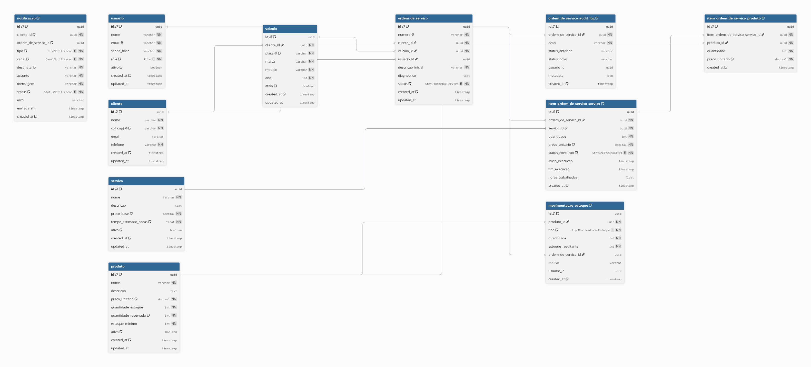
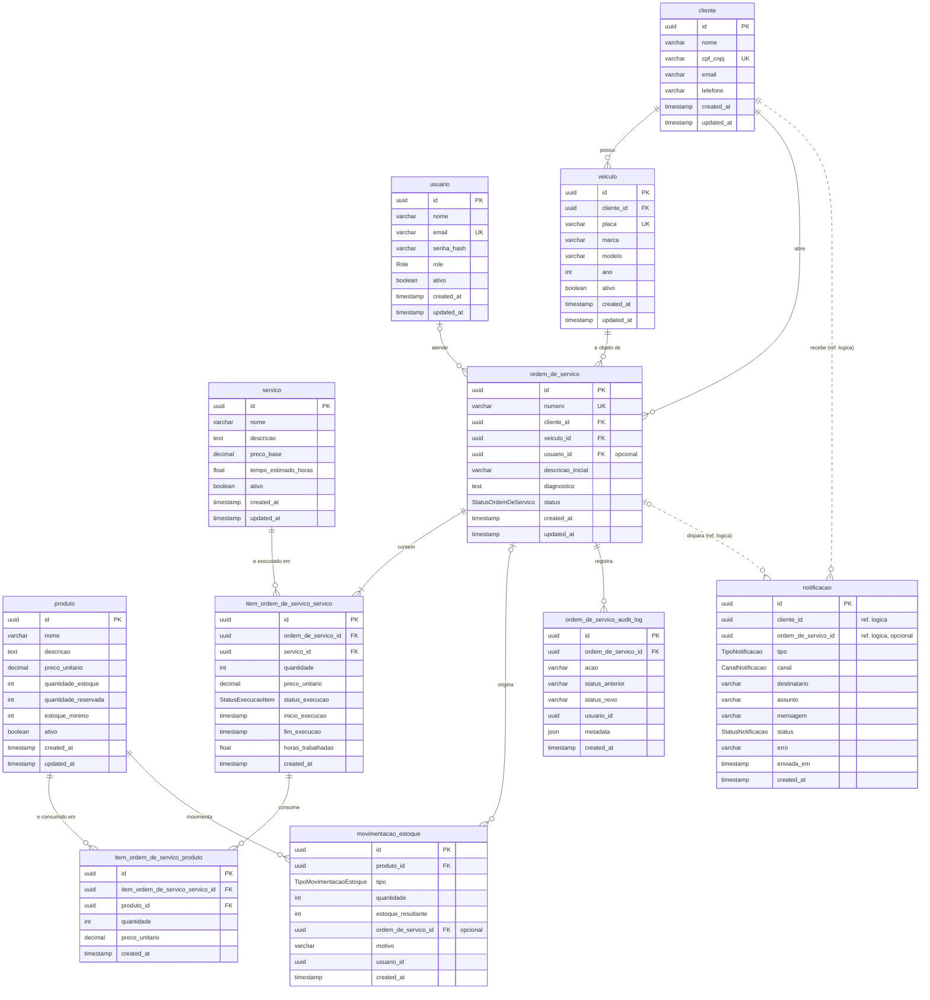

# Banco de Dados — Justificativa da Escolha e Modelo Relacional

> **US:** [US-F3-DOC-04](../user-stories/f3-doc-04-justificativa-banco-er.md)
> **Decisão (registro):** [RFC-0002 — Escolha do banco de dados gerenciado](rfcs/RFC-0002-escolha-do-banco.md)
> **Fonte canônica do schema:** [`docs/schema.dbml`](../schema.dbml) (importável no [dbdiagram.io](https://dbdiagram.io)) · Prisma: [`prisma/schema.prisma`](../../prisma/schema.prisma)
> **Infra do banco (repo 3):** [`soat-fiap-oficina-infra-db`](https://github.com/engineercodeprojects/soat-fiap-oficina-infra-db) — `database.tf` / `variables.tf`

Este documento consolida (1) **por que** o Sistema da Oficina Mecânica usa
**PostgreSQL gerenciado (Amazon RDS)** e não outra tecnologia, e (2) **como** o
modelo relacional está estruturado: diagrama ER, relacionamentos, ajustes
feitos na Fase 3, garantias de consistência e estratégia de índices.

A [RFC-0002](rfcs/RFC-0002-escolha-do-banco.md) é o **registro enxuto da
decisão** (contexto, opções, decisão, consequências). Este documento é a
**justificativa formal detalhada** que a RFC referencia — o conteúdo foi
originado no PR #1 do repositório `soat-fiap-oficina-infra-db` e consolidado
aqui, no repositório da aplicação, por ser onde vivem o schema Prisma, as
migrations e o `schema.dbml`.

---

## 1. Justificativa formal da escolha: PostgreSQL gerenciado (RDS)

### 1.1 Requisitos que o banco precisa atender

| # | Requisito | Origem |
|---|---|---|
| R1 | Manter o schema e as migrations **Prisma** das Fases 1–2 sem reescrita | [`prisma/schema.prisma`](../../prisma/schema.prisma) + histórico em [`prisma/migrations/`](../../prisma/migrations/); infra-db: `engine_version` default `"16"` (mesma major do `postgres:16-alpine` usado em kind na Fase 2) e `db_name` default `oficina_mecanica` ("mantido igual à Fase 2 para não quebrar o contrato do Prisma") |
| R2 | **Transações ACID** e **integridade referencial** para ordem de serviço (OS) e reserva/baixa de estoque | Domínio: uma OS envolve cliente, veículo, itens de serviço, produtos consumidos, movimentações de estoque e audit log — tudo precisa mudar de forma atômica |
| R3 | **Alta disponibilidade** com failover automático | [US-F3-04](../user-stories/f3-04-terraform-banco-gerenciado.md): `multi_az` default `true` (`variables.tf` / `database.tf` do infra-db) |
| R4 | **Backups**, **criptografia em repouso** e **patches** gerenciados | `database.tf` (infra-db): `backup_retention_period` (default 7 dias), `backup_window`, `maintenance_window`, `storage_encrypted = true`, `auto_minor_version_upgrade = true` |
| R5 | **Custo** compatível com o AWS Academy Learner Lab | `instance_class` default `db.t3.micro` ("cobre a carga do Tech Challenge dentro do orçamento do AWS Academy Learner Lab") |
| R6 | Operar **sem criar roles IAM** (restrição do Learner Lab: apenas `LabRole`) | `database.tf` (infra-db): sem Enhanced Monitoring / Performance Insights / IAM DB Auth |

### 1.2 Alternativas avaliadas

> A RFC-0002 resume as opções em uma linha cada; aqui cada alternativa é
> confrontada com os requisitos R1–R6.

#### (a) NoSQL — Amazon DynamoDB

- **R1 (Prisma/dialeto):** falha. O Prisma não tem provider maduro para
  DynamoDB; toda a camada de persistência (repositórios, migrations, seeds)
  teria que ser reescrita. Perde-se todo o investimento das Fases 1–2.
- **R2 (ACID/integridade):** parcial. DynamoDB oferece transações limitadas
  (`TransactWriteItems`, até 100 itens, sem joins e sem FK). A integridade
  referencial entre `ordem_de_servico`, `item_ordem_de_servico_*`,
  `movimentacao_estoque` e `produto` teria que ser reimplementada na
  aplicação. Regras como "não reservar mais do que `quantidade_estoque -
  quantidade_reservada`" dependem de leitura + escrita condicional
  atômica com múltiplas entidades — natural em SQL, frágil em single-table
  design.
- **Consultas de dashboard** (OS por status/período, produtos abaixo do
  estoque mínimo, histórico por cliente) exigiriam GSIs desenhados
  antecipadamente para cada padrão de acesso; consultas ad hoc são caras
  (`Scan`).
- **R3–R5:** atende (serverless, HA nativa, barato em baixo volume) — mas os
  ganhos não compensam a reescrita e a perda do modelo relacional.

**Veredito:** descartado. O domínio é fortemente relacional e transacional.

#### (b) MySQL / MariaDB (RDS)

- **R1:** falha parcial. Prisma suporta MySQL, mas o dialeto muda: enums
  nativos do Postgres (`Role`, `StatusOrdemDeServico`, …), `uuid` nativo com
  `uuid_generate_v4()`, `json`, `timestamp` sem timezone vs `DATETIME`,
  `text`… Todas as migrations existentes teriam que ser regeneradas e
  revalidadas.
- **R2:** atende (InnoDB é ACID e tem FKs).
- **R3–R5:** equivalentes ao Postgres no RDS (mesmo `db.t3.micro`, mesmo
  Multi-AZ, mesmo preço).
- **Sem vantagem técnica** que justifique a troca: nenhum requisito do
  sistema é melhor atendido por MySQL.

**Veredito:** descartado. Custo de migração sem benefício.

#### (c) PostgreSQL auto-hospedado (container no EKS ou EC2)

- **R1–R2:** atende (é o mesmo Postgres).
- **R3 (HA):** falha na prática. Failover automático exigiria operar
  Patroni/Stolon/CloudNativePG ou replicação streaming manual — trabalho
  de DBA que o time não tem e que sai do escopo do Tech Challenge.
- **R4 (backups/patches/criptografia):** tudo manual: `pg_dump`/WAL-G
  agendados, rotação, testes de restore, upgrade de minor versions,
  criptografia de volumes EBS. Foi exatamente o cenário da Fase 2 (Postgres
  in-cluster no kind) que a US-F3-04 se propõe a **substituir**.
- **Risco operacional:** um pod de banco em EKS compartilha ciclo de vida
  com o cluster (drain de nodes, upgrades, PVC) — a fonte de verdade do
  negócio não deve estar acoplada ao plano de aplicação.
- **R5:** custo similar ou maior (EC2 + EBS + tempo de operação).

**Veredito:** descartado. Elimina o ganho central da US-F3-04 ("sem operar o
banco manualmente").

#### (d) Amazon Aurora PostgreSQL

- **R1–R4:** atende — é compatível com Postgres e gerenciado, com HA e
  backups ainda mais robustos (storage distribuído em 3 AZs, replicas de
  leitura com failover em segundos).
- **R5 (custo):** falha. Aurora não oferece `db.t3.micro`: a menor classe
  provisionada é `db.t3.medium`/`db.t4g.medium` (≈ US$ 60–80/mês por
  instância, +I/O cobrado por request) e Aurora Serverless v2 tem custo
  mínimo por ACU-hora que, sob carga contínua, supera o `db.t3.micro`
  Multi-AZ (≈ US$ 25–30/mês, ver README do infra-db > "Custo estimado"). Para o volume
  do Tech Challenge, é super-dimensionado.
- **R6:** alguns recursos (Performance Insights, IAM Auth, RDS Proxy)
  ficariam igualmente indisponíveis no Learner Lab — não há ganho ali.
- **Vendor lock-in** maior: Aurora é proprietário; RDS for PostgreSQL é o
  Postgres upstream, portável para qualquer provedor ou on-premises.

**Veredito:** descartado para esta fase. É o **caminho natural de evolução**
se o volume crescer — a migração RDS → Aurora é suportada nativamente
(snapshot/replica), sem tocar na aplicação.

### 1.3 Tabela comparativa

Legenda: **✔** atende · **~** atende parcialmente / com esforço · **✘** não atende.

| Critério | DynamoDB (NoSQL) | MySQL/MariaDB (RDS) | Postgres auto-hospedado | Aurora PostgreSQL | **RDS PostgreSQL** |
|---|:---:|:---:|:---:|:---:|:---:|
| R1 — Reuso do schema/migrations Prisma (zero reescrita) | ✘ | ~ | ✔ | ✔ | **✔** |
| R2 — ACID + integridade referencial (FK, UNIQUE, transações multi-tabela) | ~ | ✔ | ✔ | ✔ | **✔** |
| R3 — HA com failover automático sem operação manual | ✔ | ✔ | ✘ | ✔ | **✔** (Multi-AZ) |
| R4 — Backups, criptografia e patches gerenciados | ✔ | ✔ | ✘ | ✔ | **✔** (7 dias, gp3 criptografado) |
| R5 — Custo dentro do AWS Academy (`db.t3.micro`) | ✔ | ✔ | ~ | ✘ | **✔** |
| R6 — Funciona sem criar roles IAM (`LabRole`) | ✔ | ✔ | ✔ | ✔ | **✔** |
| Consultas ad hoc / dashboards (joins, agregações, índices compostos) | ✘ | ✔ | ✔ | ✔ | **✔** |
| Enums nativos, `uuid`, `json`, tipos ricos | ✘ | ~ | ✔ | ✔ | **✔** |
| Portabilidade (sem lock-in) | ✘ | ✔ | ✔ | ~ | **✔** |
| Esforço de migração a partir da Fase 2 | Alto | Médio | Baixo | Baixo | **Nenhum** |
| **Resultado** | Reprovado | Reprovado | Reprovado | Adiado | **✅ Escolhido** |

### 1.4 Decisão

**Amazon RDS for PostgreSQL 16, Multi-AZ, `db.t3.micro`, gp3 criptografado,
backups de 7 dias** — exatamente o que o `database.tf` do infra-db provisiona
com os defaults de `variables.tf`. É a única alternativa que atende **todos**
os requisitos R1–R6 simultaneamente, sem reescrita de aplicação e sem custo
operacional de DBA. O registro formal da decisão é a
[RFC-0002](rfcs/RFC-0002-escolha-do-banco.md).

---

## 2. Modelo relacional

### 2.1 Diagrama ER

Fonte canônica: [`docs/schema.dbml`](../schema.dbml). A imagem abaixo é
derivada dele. Para (re)gerar a imagem:

1. Abra <https://dbdiagram.io> → *Import* → *From DBML* e cole o conteúdo de
   `docs/schema.dbml` (ou, com a CLI: `npx -y @dbml/cli dbml2sql docs/schema.dbml --postgres`
   para validar a sintaxe antes de importar);
2. *Auto-arrange* → *Left-right*, zoom 100%;
3. *Export* → *PNG* e salve como `docs/arquitetura/er-diagram.png` (a mesma
   imagem é usada no PDF de entrega da Fase 3).

Para alterar o modelo, **edite o `.dbml`** (e o `schema.prisma`/migration
correspondente), reimporte e exporte novamente — nunca edite a imagem à mão.



### 2.2 Diagrama ER (Mermaid — fallback textual)



Notação: `||` exatamente um · `|o` zero ou um · `o{` zero ou muitos ·
`|{` um ou muitos · linha tracejada = referência lógica sem FK física.

### 2.3 Enums de domínio

| Enum | Valores | Usado em |
|---|---|---|
| `Role` | `ADMIN`, `ATENDENTE`, `MECANICO`, `ESTOQUISTA`, `CLIENTE` | `usuario.role` |
| `StatusOrdemDeServico` | `RECEBIDA` → `EM_DIAGNOSTICO` → `AGUARDANDO_APROVACAO` → `EM_EXECUCAO` → `FINALIZADA` → `ENTREGUE`; `CANCELADA` | `ordem_de_servico.status` |
| `StatusExecucaoItem` | `PENDENTE`, `EM_EXECUCAO`, `CONCLUIDO` | `item_ordem_de_servico_servico.status_execucao` |
| `TipoMovimentacaoEstoque` | `ENTRADA`, `SAIDA`, `RESERVA`, `ESTORNO_RESERVA`, `BAIXA` | `movimentacao_estoque.tipo` |
| `TipoNotificacao` | `ORCAMENTO_PRONTO`, `OS_FINALIZADA`, `STATUS_OS_ALTERADO` | `notificacao.tipo` |
| `CanalNotificacao` | `EMAIL` | `notificacao.canal` |
| `StatusNotificacao` | `PENDENTE`, `ENVIADA`, `FALHOU` | `notificacao.status` |

---

## 3. Relacionamentos

Cada subseção descreve: tabelas envolvidas, coluna(s) FK, cardinalidade e a
regra de negócio que o relacionamento materializa.

### 3.1 `cliente` 1—N `veiculo`

- **FK:** `veiculo.cliente_id → cliente.id` (`NOT NULL`)
- **Cardinalidade:** um cliente possui zero ou muitos veículos; todo veículo
  pertence a exatamente um cliente.
- **Regra de negócio:** o veículo é sempre cadastrado em nome de um cliente
  (pessoa física ou jurídica, `cpf_cnpj`). A `placa` é única no sistema — o
  mesmo veículo não pode aparecer duas vezes, nem em clientes diferentes;
  troca de proprietário é um `UPDATE` de `cliente_id`, preservando o
  histórico de OS do veículo. `ativo = false` desativa sem apagar.

### 3.2 `cliente` 1—N `ordem_de_servico`

- **FK:** `ordem_de_servico.cliente_id → cliente.id` (`NOT NULL`)
- **Cardinalidade:** um cliente abre zero ou muitas OS; toda OS tem
  exatamente um cliente.
- **Regra de negócio:** o cliente é quem aprova o orçamento e recebe as
  notificações (`ORCAMENTO_PRONTO`, `OS_FINALIZADA`). A FK garante que não
  existe OS "órfã" e é o eixo das consultas "histórico do cliente" e da
  autenticação por CPF (Lambda, repo 1) que devolve as OS do cliente.

### 3.3 `veiculo` 1—N `ordem_de_servico`

- **FK:** `ordem_de_servico.veiculo_id → veiculo.id` (`NOT NULL`)
- **Cardinalidade:** um veículo passa por zero ou muitas OS; toda OS
  refere-se a exatamente um veículo.
- **Regra de negócio:** toda OS é aberta *para um veículo* (é ele que entra
  na oficina). A aplicação valida, na abertura, que
  `veiculo.cliente_id = ordem_de_servico.cliente_id` — o banco guarda as duas
  FKs porque o veículo pode mudar de dono depois e a OS antiga deve continuar
  apontando para quem de fato pagou. Habilita o histórico de manutenção por
  placa.

### 3.4 `usuario` 1—N `ordem_de_servico` (opcional)

- **FK:** `ordem_de_servico.usuario_id → usuario.id` (`NULL` permitido)
- **Cardinalidade:** um usuário (mecânico/atendente) é responsável por zero
  ou muitas OS; uma OS tem zero ou um responsável.
- **Regra de negócio:** na criação (`RECEBIDA`) a OS ainda não tem mecânico
  designado — por isso a FK é opcional. A atribuição ocorre em
  `EM_DIAGNOSTICO`/`EM_EXECUCAO`. O `usuario.role` (`MECANICO`, `ATENDENTE`,
  …) é validado no domínio, não por constraint.

### 3.5 `ordem_de_servico` 1—N `item_ordem_de_servico_servico` N—1 `servico` (decomposição N:N)

- **FKs:** `item_ordem_de_servico_servico.ordem_de_servico_id → ordem_de_servico.id`
  (`NOT NULL`) e `item_ordem_de_servico_servico.servico_id → servico.id`
  (`NOT NULL`)
- **Índice único composto:** `(ordem_de_servico_id, servico_id)`
- **Cardinalidade:** uma OS contém um ou muitos itens de serviço; um serviço
  do catálogo aparece em zero ou muitas OS. Conceitualmente, **OS ↔ serviço é
  N:N**; a tabela `item_ordem_de_servico_servico` é a entidade associativa
  que decompõe essa relação em duas 1:N.
- **Por que uma tabela associativa com atributos próprios, e não só um par
  de FKs:** o item carrega estado que pertence à *ocorrência* do serviço
  naquela OS — `quantidade`, `preco_unitario` **congelado no momento do
  orçamento** (se o catálogo mudar de preço, a OS aprovada não muda),
  `status_execucao`, `inicio_execucao`/`fim_execucao` e `horas_trabalhadas`
  (comparadas ao `servico.tempo_estimado_horas` para métricas de
  produtividade). O índice único garante que o mesmo serviço não seja
  lançado duas vezes na mesma OS — quantidades repetidas vão em
  `quantidade`.

### 3.6 `item_ordem_de_servico_servico` 1—N `item_ordem_de_servico_produto` N—1 `produto`

- **FKs:** `item_ordem_de_servico_produto.item_ordem_de_servico_servico_id →
  item_ordem_de_servico_servico.id` (`NOT NULL`) e
  `item_ordem_de_servico_produto.produto_id → produto.id` (`NOT NULL`)
- **Índice único composto:** `(item_ordem_de_servico_servico_id, produto_id)`
- **Cardinalidade:** um item de serviço consome zero ou muitos produtos
  (peças/insumos); um produto é consumido em zero ou muitos itens de serviço.
- **Regra de negócio:** peças são vinculadas **ao serviço que as consome**, e
  não diretamente à OS — "troca de óleo" consome óleo e filtro; "pastilhas"
  consome pastilhas. Isso permite orçamento detalhado por serviço, cálculo
  de margem por serviço e estorno preciso se um único serviço for cancelado.
  `preco_unitario` é congelado no orçamento pelo mesmo motivo de 3.5. O
  índice único impede lançar a mesma peça duas vezes no mesmo item.

### 3.7 `produto` 1—N `movimentacao_estoque` (+ FK opcional para `ordem_de_servico`)

- **FKs:** `movimentacao_estoque.produto_id → produto.id` (`NOT NULL`) e
  `movimentacao_estoque.ordem_de_servico_id → ordem_de_servico.id` (`NULL`
  permitido)
- **Cardinalidade:** um produto tem zero ou muitas movimentações; cada
  movimentação refere-se a exatamente um produto e a zero ou uma OS.
- **Regra de negócio:** `movimentacao_estoque` é o **livro-razão (ledger)
  imutável** do estoque. Cada linha registra `tipo`, `quantidade` e o
  `estoque_resultante` após a operação, permitindo auditar e reconstruir o
  saldo. A FK para OS é opcional porque movimentações de `ENTRADA` (compra
  de fornecedor) e ajustes manuais de `SAIDA` não têm OS; já `RESERVA`,
  `ESTORNO_RESERVA` e `BAIXA` sempre têm. Fluxo de uma OS:
  1. Orçamento aprovado → `RESERVA` (`produto.quantidade_reservada += n`);
  2. Serviço concluído → `BAIXA` (`quantidade_estoque -= n`,
     `quantidade_reservada -= n`);
  3. OS cancelada → `ESTORNO_RESERVA` (`quantidade_reservada -= n`).

  Cada passo atualiza `produto` e insere em `movimentacao_estoque` **na mesma
  transação** (ver §5.3).

### 3.8 `ordem_de_servico` 1—N `ordem_de_servico_audit_log`

- **FK:** `ordem_de_servico_audit_log.ordem_de_servico_id → ordem_de_servico.id`
  (`NOT NULL`)
- **Cardinalidade:** uma OS tem zero ou muitos registros de auditoria; cada
  registro pertence a exatamente uma OS.
- **Regra de negócio:** trilha *append-only* de tudo que aconteceu na OS —
  `acao`, `status_anterior → status_novo`, `usuario_id` de quem fez e
  `metadata` (JSON livre: orçamento aprovado, diagnóstico alterado, etc.).
  Alimenta a linha do tempo exibida ao cliente e o cálculo do **tempo médio
  por etapa** (diferença de `created_at` entre transições). `usuario_id`
  aqui é referência lógica (sem FK) para que o log sobreviva à remoção de
  usuários.

### 3.9 `ordem_de_servico` 1—N `notificacao` e `cliente` 1—N `notificacao` (referências lógicas)

- **Colunas:** `notificacao.cliente_id` (`NOT NULL`) e
  `notificacao.ordem_de_servico_id` (`NULL` permitido) — **sem FK física**,
  apenas índices simples em cada coluna.
- **Cardinalidade (lógica):** um cliente recebe zero ou muitas notificações;
  uma OS dispara zero ou muitas notificações; uma notificação pertence a um
  cliente e, opcionalmente, a uma OS (notificações não ligadas a OS, como
  boas-vindas, não têm `ordem_de_servico_id`).
- **Por que referências lógicas e não FKs:** decisão deliberada, mantida
  nesta US (documentada em comentário no `schema.dbml`):
  1. `notificacao` é um **registro imutável de envio** (o que foi mandado,
     para qual `destinatario`, com qual `status`/`erro`) — um *outbox* de
     mensageria. Não participa das transações do domínio da OS; é escrito
     por um processo assíncrono depois do commit da OS, e FKs acoplariam o
     subsistema de notificação ao ciclo de vida de cliente/OS (um
     `DELETE`/anonimização LGPD de cliente não deve falhar nem apagar o
     histórico de que um e-mail foi enviado).
  2. O `destinatario` é **desnormalizado** propositalmente: o e-mail usado no
     envio é o daquele instante, não o `cliente.email` atual.
  3. Prepara a extração do serviço de notificação para fora do banco
     principal (fila/SNS) sem migração de schema.

  Os índices em `cliente_id` e `ordem_de_servico_id` mantêm as consultas
  "notificações da OS" e "notificações do cliente" eficientes mesmo sem FK.

---

## 4. Ajustes no modelo relacional (Fase 3)

Mudanças feitas ou formalizadas na Fase 3 em relação ao modelo herdado das
Fases 1–2, com o porquê de cada uma. O que já está em migration está marcado
como **aplicado**; o restante é **proposto** e deve entrar via migration
Prisma (`prisma/migrations/`) + atualização do `schema.dbml`.

| # | Ajuste | Tipo | Estado | Por quê |
|---|---|---|---|---|
| A1 | `item_ordem_de_servico_produto` passa a referenciar `item_ordem_de_servico_servico` em vez de `ordem_de_servico` (migration `20260501000000_produto_vincula_a_servico`) | Normalização | Aplicado (Fase 2) | Peça pertence ao serviço que a consome (§3.6): elimina a ambiguidade "peça avulsa na OS", permite margem por serviço e estorno preciso por item. O índice único mudou para `(item_ordem_de_servico_servico_id, produto_id)`. |
| A2 | `notificacao.cliente_id` / `ordem_de_servico_id` documentados como **referências lógicas** (sem FK), com nota no `schema.dbml` | Constraint (decisão explícita) | Aplicado (docs) | Outbox imutável de envio desacoplado do ciclo de vida de cliente/OS — ver §3.9. Antes era uma ausência de FK não documentada; agora é decisão registrada, para não ser "corrigida" por engano. |
| A3 | Índice `ordem_de_servico (status, created_at)` | Índice | Proposto (P1) | Dashboards de [US-F3-11](../user-stories/f3-11-dashboards-alertas.md): **volume diário de OS** (`GROUP BY date_trunc('day', created_at)`, opcionalmente por status) e painel operacional por status/período. |
| A4 | Índice `ordem_de_servico_audit_log (status_novo, created_at)` | Índice | Proposto (P8) | Dashboard **tempo médio de execução por status** (Diagnóstico, Execução, Finalização): agrega transições por janela de tempo, independente da OS. O índice atual `(ordem_de_servico_id, created_at)` só serve à linha do tempo de *uma* OS. |
| A5 | Índices em FKs sem índice: `ordem_de_servico (cliente_id)`, `ordem_de_servico (veiculo_id)`, `veiculo (cliente_id)`, `item_ordem_de_servico_servico (servico_id)`, `item_ordem_de_servico_produto (produto_id)` | Índice | Proposto (P2, P3, P5, P6, P7) | Postgres não indexa FKs automaticamente; joins e filtros "OS do cliente", "OS do veículo", "serviços/peças mais usados" fazem seq scan hoje. |
| A6 | Índice parcial `notificacao (status) WHERE status IN ('PENDENTE','FALHOU')` | Índice | Proposto (P9) | Worker de reenvio e alerta **falha de entrega de notificação** (US-F3-11) leem só o subconjunto pequeno de pendentes/falhas. |
| A7 | Índice de expressão `produto ((quantidade_estoque - quantidade_reservada))` | Índice | Proposto (P4) | Alerta de estoque mínimo (`disponível <= estoque_minimo`) sem varrer todo o catálogo. |
| A8 | Constraints `CHECK` em `produto` (`quantidade_estoque >= 0`, `quantidade_reservada >= 0`, `quantidade_reservada <= quantidade_estoque`) e em `item_*` (`quantidade > 0`, `preco_unitario > 0`) | Constraint | Proposto | Hoje validadas só no domínio; o `CHECK` é a última linha de defesa contra saldo negativo em concorrência ou via acesso direto ao banco. Prisma não gera `CHECK` — entra como SQL manual na migration. |

Prioridade: A3 e A4 (dashboards exigidos pelo enunciado) → A5 → A6/A7 → A8.
Todos os índices propostos são baratos em `db.t3.micro` (tabelas estreitas,
escrita moderada) e devem ser validados com `EXPLAIN (ANALYZE, BUFFERS)`
antes e depois (ver §6.3).

---

## 5. Consistência e integridade

### 5.1 Constraints declarativas

| Tabela | Constraint | Garantia de negócio |
|---|---|---|
| `usuario.email` | `UNIQUE NOT NULL` | Um login por e-mail |
| `cliente.cpf_cnpj` | `UNIQUE NOT NULL` | Um cadastro por CPF/CNPJ — base da autenticação por CPF (Lambda) |
| `veiculo.placa` | `UNIQUE NOT NULL` | Um veículo por placa em todo o sistema |
| `ordem_de_servico.numero` | `UNIQUE NOT NULL` | Número legível da OS é único (impresso no orçamento/recibo) |
| `item_ordem_de_servico_servico (ordem_de_servico_id, servico_id)` | `UNIQUE` | Mesmo serviço não é lançado duas vezes na mesma OS |
| `item_ordem_de_servico_produto (item_ordem_de_servico_servico_id, produto_id)` | `UNIQUE` | Mesma peça não é lançada duas vezes no mesmo item de serviço |
| Todas as FKs de §3 (exceto 3.9) | `FOREIGN KEY` (+ `NOT NULL` onde obrigatório) | Nenhuma OS/item/movimentação órfão; relacionamentos opcionais explicitados por `NULL` |
| Todas as PKs | `uuid` com `uuid_generate_v4()` | IDs não sequenciais/não enumeráveis expostos na API |

Validações que **não** cabem em constraint e ficam nos Value Objects do
domínio (`src/*/domain`): formato de CPF/CNPJ, placa (antiga/Mercosul),
`preco_* > 0`, `veiculo.cliente_id = ordem_de_servico.cliente_id`, transições
válidas de `StatusOrdemDeServico`.

### 5.2 Enums de domínio como tipos nativos

Os sete enums de §2.3 são **tipos `ENUM` do PostgreSQL** (gerados pelo
Prisma). O banco rejeita qualquer valor fora do conjunto — um `status =
'FINALIZADO'` (typo) falha no `INSERT`, em vez de virar um registro
invisível para os filtros do dashboard. É um dos motivos para não usar
MySQL (enums via `ENUM` de coluna, sem tipo reutilizável) nem DynamoDB (sem
validação de valores).

### 5.3 Transações no fluxo de estoque

Reserva, baixa e estorno (§3.7) alteram **duas tabelas** e precisam ser
atômicas; sem isso, um erro entre o `UPDATE produto` e o `INSERT
movimentacao_estoque` deixaria o saldo e o ledger inconsistentes.

Padrão (Prisma `$transaction` interativo, isolamento padrão `READ COMMITTED`
com lock de linha):

```sql
BEGIN;

-- 1. Trava a linha do produto para serializar reservas concorrentes
SELECT quantidade_estoque, quantidade_reservada
  FROM produto WHERE id = $produto_id FOR UPDATE;

-- 2. Regra: disponível = quantidade_estoque - quantidade_reservada >= $n
--    (verificada na aplicação com os valores lidos sob lock; se falhar → ROLLBACK)

-- 3. Atualiza o saldo
UPDATE produto
   SET quantidade_reservada = quantidade_reservada + $n, updated_at = now()
 WHERE id = $produto_id;

-- 4. Registra no ledger, na MESMA transação
INSERT INTO movimentacao_estoque
  (produto_id, tipo, quantidade, estoque_resultante, ordem_de_servico_id, usuario_id)
VALUES
  ($produto_id, 'RESERVA', $n, <quantidade_estoque lida em 1>, $os_id, $usuario_id);

COMMIT;
```

`SELECT … FOR UPDATE` evita a condição de corrida em que duas OS reservam a
última unidade ao mesmo tempo. O mesmo padrão vale para `BAIXA` e
`ESTORNO_RESERVA`, e para a aprovação do orçamento, que reserva **todos** os
produtos de todos os itens da OS em uma única transação (tudo ou nada) e
grava o `ordem_de_servico_audit_log` correspondente no mesmo commit.

---

## 6. Performance e índices

### 6.1 Índices existentes (`schema.dbml`)

| Índice | Caso de uso |
|---|---|
| `movimentacao_estoque (produto_id, created_at)` | Extrato/kardex de um produto ordenado por data; reconstrução do saldo; auditoria de estoque |
| `movimentacao_estoque (ordem_de_servico_id)` | "Quais movimentações esta OS gerou?" — estorno em cancelamento |
| `ordem_de_servico_audit_log (ordem_de_servico_id, created_at)` | Linha do tempo da OS em ordem cronológica; tempo médio por etapa |
| `notificacao (cliente_id)` | Histórico de notificações do cliente |
| `notificacao (ordem_de_servico_id)` | Notificações disparadas por uma OS; reenvio de `FALHOU` |
| `item_ordem_de_servico_servico (ordem_de_servico_id, servico_id)` UNIQUE | Além da unicidade, cobre o join OS → itens (prefixo `ordem_de_servico_id`) |
| `item_ordem_de_servico_produto (item_ordem_de_servico_servico_id, produto_id)` UNIQUE | Idem para item → produtos |
| Índices implícitos de `UNIQUE` (`email`, `cpf_cnpj`, `placa`, `numero`) | Login, autenticação por CPF, busca por placa, busca por número da OS |
| PKs (`uuid`) | Lookups pontuais e alvo das FKs |

> Postgres **não** cria índice automaticamente para colunas FK. As FKs
> `veiculo.cliente_id`, `ordem_de_servico.{cliente_id, veiculo_id, usuario_id}`
> e `item_ordem_de_servico_produto.produto_id` hoje dependem de seq scan nos
> joins/filtragens — endereçado abaixo.

### 6.2 Índices adicionais propostos (dashboards e consultas operacionais)

Volumes esperados são pequenos (`db.t3.micro`), mas estes índices são baratos
(tabelas com poucas colunas, escrita moderada) e transformam os *scans* das
telas mais acessadas em *index scans*. Devem ser adicionados via migration
Prisma neste repositório (`@@index` em `prisma/schema.prisma`) e refletidos no `schema.dbml`.

| # | Índice proposto | Caso de uso (dashboard / consulta) | Justificativa |
|---|---|---|---|
| P1 | `ordem_de_servico (status, created_at)` | **Painel operacional**: "OS em `EM_EXECUCAO` hoje", "OS `AGUARDANDO_APROVACAO` há mais de 48h", contagem por status no período. Filtro de status + intervalo de datas é a consulta mais frequente da tela inicial. | `status` é seletivo (7 valores, distribuição desigual: `ENTREGUE` domina com o tempo) e `created_at` permite *range scan* ordenado dentro do status — evita ordenar em memória. Cobre também `GROUP BY status`. |
| P2 | `ordem_de_servico (cliente_id)` | **Histórico do cliente** e tela pós-login por CPF (Lambda → app): "minhas OS". | FK sem índice; hoje cada acesso do cliente faz seq scan em toda a tabela de OS. Considerar `(cliente_id, created_at DESC)` para paginar do mais recente. |
| P3 | `ordem_de_servico (veiculo_id)` | **Histórico de manutenção por placa** (busca por `placa` → `veiculo.id` → OS). | Mesmo racional de P2; FK usada em join e filtro. |
| P4 | `produto (quantidade_estoque)` — ou parcial: `WHERE ativo` | **Alerta de estoque mínimo**: `WHERE quantidade_estoque - quantidade_reservada <= estoque_minimo`. | Permite ao planner varrer só produtos com saldo baixo. Como a comparação envolve três colunas, a forma mais eficaz é um **índice de expressão** `((quantidade_estoque - quantidade_reservada))` ou uma coluna gerada `disponivel`; o índice simples em `quantidade_estoque` já ajuda quando o filtro é "estoque < X" e serve à ordenação "produtos com menor estoque" no dashboard do estoquista. |
| P5 | `veiculo (cliente_id)` | Listar veículos do cliente na abertura de OS e na área do cliente. | FK sem índice. |
| P6 | `item_ordem_de_servico_servico (servico_id)` | **Serviços mais executados / receita por serviço** (`GROUP BY servico_id`, join com `servico`). | O índice único existente tem `ordem_de_servico_id` como prefixo e não serve para filtrar por `servico_id`. |
| P7 | `item_ordem_de_servico_produto (produto_id)` | **Peças mais consumidas** e previsão de reposição. | Idem P6: `produto_id` é a segunda coluna do índice único existente. |
| P8 | `ordem_de_servico_audit_log (created_at)` ou `(status_novo, created_at)` | **Tempo médio por etapa** em um período: agrega transições de status por janela de tempo, independente da OS. | O índice atual começa por `ordem_de_servico_id` e não atende consultas globais por período. |
| P9 | `notificacao (status) WHERE status IN ('PENDENTE','FALHOU')` (parcial) | **Worker de reenvio**: busca apenas notificações pendentes/falhas. | Índice parcial minúsculo (a maioria é `ENVIADA`), leitura O(pendentes). |

Prioridade sugerida: **P1, P2, P4** (telas principais e alerta de estoque)
→ P3, P5 (FKs em join) → P6–P9 (relatórios gerenciais).

### 6.3 Boas práticas complementares

- **Paginação por cursor** (`created_at, id`) em vez de `OFFSET` nas listagens
  de OS e movimentações, aproveitando os índices compostos.
- `EXPLAIN (ANALYZE, BUFFERS)` nas consultas do dashboard antes de adicionar
  índices não listados — em `db.t3.micro`, índices demais penalizam escrita
  e cabem pouco em memória (1 GiB).
- Sem Performance Insights no Learner Lab (ver `database.tf` do infra-db), usar
  `pg_stat_statements` (extensão padrão do RDS) para identificar as consultas
  mais caras.
- Evolução: se leituras de relatório crescerem, uma **read replica** do RDS
  (ou migração para Aurora, §1.2-d) isola dashboards da carga transacional
  sem alterar o schema.
