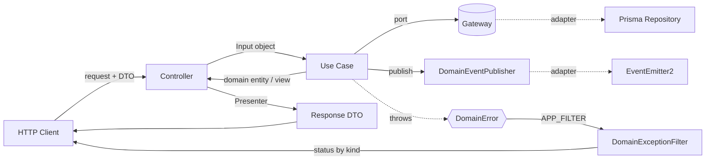
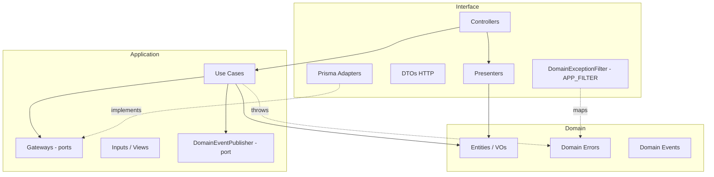

# Clean Architecture — Padrao Alvo (US-F2-10)

Este documento descreve o padrao de Clean Architecture adotado no projeto: as
camadas, o papel de cada artefato, a regra de dependencia e o fluxo de uma
requisicao. O **modulo de referencia** e `OrdemDeServico` (`src/ordem-de-servico/`);
os demais bounded contexts (Cliente, Veiculo, Servico, Produto, Autenticacao,
Notificacao) seguem o mesmo padrao.

> Conversa com a **US-F2-08** (diagrama de arquitetura): os diagramas Mermaid
> abaixo refletem Use Cases, Gateways e Presenters.

## 1. Camadas

```
┌─────────────────────────────────────────────────────────────────────┐
│ Interface (infrastructure)                                            │
│   Controllers · Presenters · DTOs HTTP · Exception Filter · Adapters  │
│   ┌─────────────────────────────────────────────────────────────┐    │
│   │ Application                                                   │    │
│   │   Use Cases · Gateways (ports) · Input/Output · Event Ports   │    │
│   │   ┌─────────────────────────────────────────────────────┐    │    │
│   │   │ Domain                                               │    │    │
│   │   │   Entities · Value Objects · Domain Errors · Events  │    │    │
│   │   └─────────────────────────────────────────────────────┘    │    │
│   └─────────────────────────────────────────────────────────────┘    │
└─────────────────────────────────────────────────────────────────────┘
        Regra de dependencia: as setas apontam SEMPRE para dentro.
```

| Camada | Pasta | Conhece | NAO conhece |
|---|---|---|---|
| **Domain** | `*/domain/` | apenas a si mesma + `shared/domain` | application, infrastructure, NestJS, Prisma |
| **Application** | `*/application/` | domain | infrastructure, Prisma, Swagger, excecoes HTTP |
| **Infrastructure / Interface** | `*/infrastructure/` | application + domain | — (e o detalhe externo) |
| **Shared kernel** | `src/shared/` | transversal | — |

## 2. Papel de cada artefato

### Domain (`*/domain/`)
- **Entities / Aggregates** (`ordem-de-servico.entity.ts`): regras de negocio e
  invariantes. Puras, sem decorators de framework/ORM.
- **Value Objects** (`value-objects/`): tipos imutaveis com validacao (CPF/CNPJ,
  placa, status, itens da OS).
- **Domain Errors** (`errors/*.error.ts`): toda regra violada lanca uma subclasse
  de `DomainError` (`src/shared/domain/domain-error.ts`) declarando seu `kind`
  (HTTP-agnostico): `NOT_FOUND`, `CONFLICT`, `INVALID_INPUT`, `FORBIDDEN`,
  `UNAUTHORIZED`.
- **Domain Events** (`events/*.event.ts`): implementam `DomainEvent`
  (`src/shared/domain/domain-event.ts`) — expõem um `eventName` estavel.

### Application (`*/application/`)
- **Use Cases** (`use-cases/*.use-case.ts`): **uma classe por caso de uso**, com
  um unico metodo `execute(input)`. Orquestram dominio + gateways. Implementam
  `UseCase<Input, Output>` (`src/shared/application/use-case.ts`).
- **Input objects**: cada use case define sua propria interface de entrada
  (ex.: `CriarOrdemDeServicoInput`) — **DTOs HTTP nao vazam** para a aplicacao.
- **Output / Views** (`views/`): view models retornados por use cases de consulta
  (ex.: `OsDetalhesView`), independentes de HTTP.
- **Gateways** (`gateways/*.gateway.ts`): **ports** que os use cases consomem.
  - de persistencia: `OrdemDeServicoGateway` (= contrato de repositorio);
  - de consulta a outros contextos (anti-corruption): `ClienteConsultaGateway`,
    `ServicoConsultaGateway`, etc. — interfaces minimas (somente leitura).
- **Event ports**: `DomainEventPublisher` (`src/shared/application/`) — porta de
  saida para publicar eventos sem acoplar a aplicacao ao framework de eventos.

### Infrastructure / Interface (`*/infrastructure/`)
- **Controllers**: finos. Apenas (1) extraem dados do request, (2) chamam **um**
  use case, (3) devolvem via Presenter. **Sem try/catch** e **sem formatacao**.
- **Presenters** (`presenters/*.presenter.ts`): traduzem entidade/saida da
  aplicacao para o shape de resposta HTTP (substituem o antigo `toResponse()`
  inline).
- **Adapters de Gateway** (`prisma-*.repository.ts`): implementam os gateways
  usando Prisma. Tambem: `MockEmailNotificador` (port `Notificador`).
- **DTOs HTTP** (`dto/`): validacao de entrada (class-validator) + Swagger.

### Shared kernel (`src/shared/`)
- `domain/domain-error.ts` — `DomainError` + `DomainErrorKind`.
- `domain/domain-event.ts` — contrato `DomainEvent`.
- `application/use-case.ts` — contrato `UseCase<I,O>`.
- `application/domain-event-publisher.ts` — porta `DomainEventPublisher` + token.
- `infrastructure/event-emitter-domain-event-publisher.ts` — adapter sobre o
  `EventEmitter2` do NestJS.
- `infrastructure/domain-exception.filter.ts` — **exception filter global**
  (`APP_FILTER`) que traduz `DomainError` -> HTTP (reusa as excecoes do Nest para
  manter o corpo de resposta identico).
- `shared.module.ts` — modulo `@Global` que prove o publisher e registra o filter.

## 3. Regra de dependencia (validada automaticamente)

As dependencias apontam **sempre para dentro**:

- `domain` nao importa `application`/`infrastructure`, NestJS ou Prisma.
- `application` nao importa Prisma, Swagger nem excecoes HTTP do Nest, nem
  `infrastructure`. (DI via `@Injectable`/`@Inject` de `@nestjs/common` e
  permitido — sao apenas metadados de injecao, nao detalhe de HTTP/ORM.)

Esta regra e verificada em CI pelo teste de fronteiras
`src/shared/architecture.spec.ts` (varre os imports do codigo-fonte e falha em
qualquer violacao para dentro->fora).

## 4. Fluxo de uma requisicao



Exemplo concreto — **Abrir uma OS** (`POST /ordens-servico`):

1. `OrdemDeServicoController.create` recebe `CreateOrdemDeServicoDto` (validado por
   `ValidationPipe`).
2. Chama `CriarOrdemDeServicoUseCase.execute({ clienteId, veiculoId, descricaoInicial })`.
3. O use case valida via `ClienteConsultaGateway` e `VeiculoConsultaGateway`
   (ports), cria a entidade `OrdemDeServico` (dominio) e persiste via
   `OrdemDeServicoGateway` (port) — implementado pelo `PrismaOrdemDeServicoRepository`.
4. Se uma regra falha, lanca um `DomainError` (ex.: `VeiculoClienteMismatchError`,
   `kind = CONFLICT`). O `DomainExceptionFilter` global o traduz para `409`.
5. Em caso de sucesso, o controller formata a saida com
   `OrdemDeServicoPresenter.toResponse(os)`.

Eventos: ao completar o diagnostico, `CompletarDiagnosticoUseCase` publica
`OrcamentoProntoEvent` via `DomainEventPublisher`. O adapter sobre `EventEmitter2`
entrega ao listener da Notificacao (`@OnEvent`), que dispara o alerta ao cliente.

## 5. Diagrama de componentes (por modulo)



## 6. Wiring (NestJS DI)

- Cada modulo registra o adapter Prisma como provider de classe e o liga **ao
  token de gateway** e ao token legado de repositorio via `useExisting`:

  ```ts
  PrismaOrdemDeServicoRepository,
  { provide: ORDEM_DE_SERVICO_GATEWAY, useExisting: PrismaOrdemDeServicoRepository },
  { provide: ORDEM_DE_SERVICO_REPOSITORY, useExisting: PrismaOrdemDeServicoRepository },
  ```

- Gateways de consulta a outro contexto sao ligados ao token de repositorio
  exportado pelo modulo daquele contexto:

  ```ts
  { provide: CLIENTE_CONSULTA_GATEWAY, useExisting: CLIENTE_REPOSITORY },
  ```

- O `DomainExceptionFilter` e registrado como `APP_FILTER` no `SharedModule`
  (`@Global`), valendo em runtime **e** nos testes e2e (DI-based).

## 7. Checklist do padrao (para novos modulos)

- [ ] Erros de negocio sao subclasses de `DomainError` com `kind`.
- [ ] Um use case por operacao, com Input proprio (sem DTO HTTP na aplicacao).
- [ ] Gateways (ports) na aplicacao; adapters Prisma na infraestrutura.
- [ ] Presenter para a saida; controller fino sem try/catch.
- [ ] Eventos publicados via `DomainEventPublisher`.
- [ ] `src/shared/architecture.spec.ts` continua verde (regra de dependencia).
- [ ] Contratos REST inalterados (mesmos endpoints/payloads/status).
```
