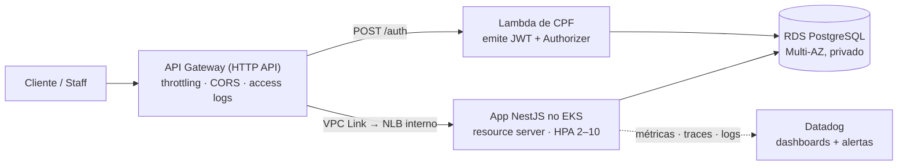

# Tech Challenge FIAP — Fase 3: Documento de Entrega

**Sistema da Oficina Mecânica** · Turma SOAT · Grupo: Guilherme Maia, Bruno Cobello, Lucas Correia, Gabriel Carneiro de Sousa

> Este documento é a fonte do **PDF único** exigido no enunciado. Os itens
> marcados com ⏳ dependem da sessão do AWS Academy (apply real) e são
> preenchidos na entrega final.

---

## 1. Repositórios (4, com CI/CD e `main` protegida)

| # | Repositório | Conteúdo | CI/CD |
|---|---|---|---|
| 1 | https://github.com/guilhermeqmaia/soat-fiap-oficina-auth-lambda | Function serverless de autenticação por CPF (AWS Lambda + Lambda Authorizer) | CI (lint/test/build) · CD (versão + alias com smoke test) · Infra (Terraform) |
| 2 | https://github.com/guilhermeqmaia/soat-fiap-oficina-infra-k8s | Terraform: VPC, EKS, API Gateway, observabilidade (agentes, dashboards, alertas) | CI (`fmt`/`validate`/`plan` comentado no PR) · CD (`apply` por branch) |
| 3 | https://github.com/guilhermeqmaia/soat-fiap-oficina-infra-db | Terraform: RDS PostgreSQL Multi-AZ + segredo de conexão | CI (`fmt`/`validate`/`plan`) · CD (`apply` por branch) |
| 4 | https://github.com/guilhermeqmaia/soat-fiap-oficina-mecanica-app | Aplicação NestJS (resource server), manifestos K8s/EKS, documentação da arquitetura | CI (testes, gate 80%, kind) · CD AWS (ECR + EKS + migrations + smoke) |

### Proteção da branch `main` (evidência coletada via API do GitHub)

| Repositório | Regras | `soat-architecture` |
|---|---|---|
| `soat-fiap-oficina-mecanica-app` | PR obrigatório (1 aprovação) · force-push bloqueado · deleção bloqueada | colaborador ✅ |
| `soat-fiap-oficina-auth-lambda` | PR obrigatório (1 aprovação) · force-push bloqueado · deleção bloqueada | convite pendente ⏳ |
| `soat-fiap-oficina-infra-k8s` | PR obrigatório (1 aprovação) · force-push bloqueado · deleção bloqueada | convite pendente ⏳ |
| `soat-fiap-oficina-infra-db` | PR obrigatório (1 aprovação) · force-push bloqueado · deleção bloqueada | convite pendente ⏳ |

Regras iguais nos 4 repositórios: sem commit direto na `main`, **pull request
obrigatório** com ao menos 1 aprovação, `CODEOWNERS` sugerindo os 4
integrantes como revisores, template de PR com checklist. Deploy automático:
branch `homolog` → homologação, `main` → produção.

> ⏳ Convites do usuário `soat-architecture` enviados nos 4 repositórios
> (aceito no repo 4; pendentes de aceite nos repos 1–3 em 11/09/2026).

---

## 2. Vídeo (≤ 15 min)

⏳ **Link:** _a publicar após o apply na AWS_

Roteiro (ordem do enunciado):

1. **Autenticação com CPF** — `POST {gateway}/auth` com CPF de cliente → JWT; com CPF + senha de staff → JWT com role; token inválido → 401 na borda (Lambda Authorizer)
2. **Pipeline CI/CD** — PR aberto → checks obrigatórios → merge → deploy automático (workflow `cd-aws.yml`)
3. **Deploy automatizado** — imagem no ECR, rollout no EKS, job de migrations, smoke test
4. **Consumo das APIs protegidas** — `GET /auth/me`, `GET /clientes/:cpf/ordens-servico` (posse por CPF do token), `/usuario` (403 para CLIENTE)
5. **Dashboard ao vivo** — painéis "Oficina — Operação" (volume de OS, tempo por status, erros de integração) e "Saúde técnica" (latência p95/p99, 5xx, CPU/memória, réplicas do HPA)
6. **Logs e traces** — log JSON com `x-correlation-id` e `trace_id`, casando com o trace no APM

---

## 3. Documentação

| Documento | Link |
|---|---|
| Índice geral da documentação | https://github.com/guilhermeqmaia/soat-fiap-oficina-mecanica-app/blob/main/docs/README.md |
| Arquitetura (componentes, sequência de auth e de OS, fluxo de deploy) | https://github.com/guilhermeqmaia/soat-fiap-oficina-mecanica-app/blob/main/docs/arquitetura/arquitetura-fase3.md |
| RFCs — nuvem, banco, autenticação | https://github.com/guilhermeqmaia/soat-fiap-oficina-mecanica-app/blob/main/docs/arquitetura/rfcs/README.md |
| ADRs — comunicação, HPA, resource server, observabilidade, gateway, 4 repos | https://github.com/guilhermeqmaia/soat-fiap-oficina-mecanica-app/blob/main/docs/arquitetura/adr/README.md |
| Justificativa do banco + modelo relacional + ER | https://github.com/guilhermeqmaia/soat-fiap-oficina-mecanica-app/blob/main/docs/arquitetura/banco-de-dados.md |
| Modelo ER (DBML, importável no dbdiagram.io) | https://github.com/guilhermeqmaia/soat-fiap-oficina-mecanica-app/blob/main/docs/schema.dbml |
| Plano de execução da Fase 3 (ondas, decisões, mapa dos repos) | https://github.com/guilhermeqmaia/soat-fiap-oficina-mecanica-app/blob/main/docs/plano-execucao-fase-3.md |
| User stories da Fase 3 | https://github.com/guilhermeqmaia/soat-fiap-oficina-mecanica-app/blob/main/docs/user-stories/README.md |
| QA Plans (Fase 3, backfill e integração cross-story) | https://github.com/guilhermeqmaia/soat-fiap-oficina-mecanica-app/blob/main/docs/qa-plans/README.md |
| Swagger / OpenAPI | `{app_url}/api` (local: http://localhost:3000/api) — ⏳ URL pública via gateway |
| Contrato da Lambda (CPF → JWT, authorizer) | https://github.com/guilhermeqmaia/soat-fiap-oficina-auth-lambda#contrato |
| Deploy no EKS (overlay, rollback, contrato com o gateway) | https://github.com/guilhermeqmaia/soat-fiap-oficina-mecanica-app/blob/main/k8s-aws/README.md |
| Observabilidade no cluster (agentes, dashboards, alertas, runbooks) | https://github.com/guilhermeqmaia/soat-fiap-oficina-infra-k8s/blob/main/observability/README.md |

---

## 4. Deploy ativo

| Componente | URL |
|---|---|
| API Gateway (única entrada pública) | ⏳ output `api_base_url` do stage `gateway/` |
| Dashboard de negócio (Datadog) | ⏳ output `dashboard_negocio_url` |
| Dashboard técnico (Datadog) | ⏳ output `dashboard_tecnico_url` |

---

## 5. Resumo da arquitetura

Decisões-chave (detalhadas nas RFCs/ADRs): AWS Academy como nuvem (LabRole,
`us-east-1`); **só o API Gateway é público** — tudo o mais dentro da VPC;
**uma única Lambda** emite e valida o JWT (cliente por CPF, staff por CPF +
senha, conforme orientação do professor no fórum); o monólito **não emite
tokens** (resource server); Datadog como plataforma de observabilidade com
Prometheus/Grafana como alternativa OSS consumindo o mesmo `/metrics`.

---

## 6. Checklist de entrega (enunciado)

- [x] 4 repositórios com código, CI/CD e README (propósito, tecnologias, execução/deploy, diagrama, Swagger)
- [x] `main` protegida com PR obrigatório nos 4 repos
- [x] Autenticação por CPF via API Gateway + Lambda (código e testes; ⏳ demonstração ao vivo)
- [x] Terraform: EKS, RDS, API Gateway, Lambda
- [x] Observabilidade: logs JSON com correlação, `/metrics`, APM, dashboards e alertas como código
- [x] RFCs, ADRs, diagramas de componentes e sequência, justificativa do banco + ER
- [ ] ⏳ Apply na AWS + URLs de deploy ativo
- [ ] ⏳ Vídeo (≤15 min) publicado
- [ ] ⏳ `soat-architecture` com convite aceito nos 4 repos
