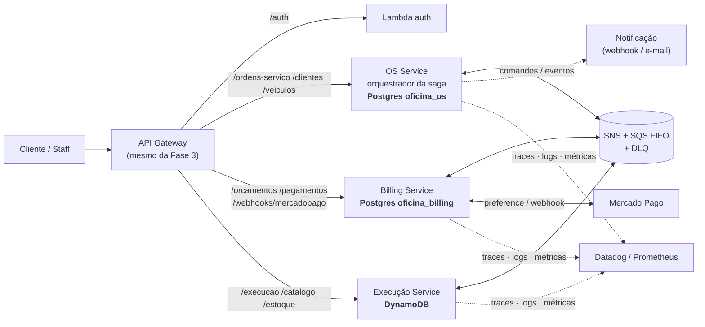

# Plano de Execução — Fase 4 Tech Challenge

**Tema:** Microsserviços, Saga Pattern e automação completa · **Enunciado:** [`docs/tech-challenges/fase-4-tech-challenge.pdf`](tech-challenges/fase-4-tech-challenge.pdf)

> Este documento faz para a Fase 4 o que [`plano-execucao-fase-3.md`](plano-execucao-fase-3.md)
> fez para a Fase 3: resume o enunciado, registra o que o mercado faz, propõe as
> decisões (a serem formalizadas em RFC/ADR na Onda 0), mapeia os repositórios e
> organiza as histórias em ondas.

---

## O que a Fase 4 exige (resumo do enunciado)

| Requisito | Detalhe |
|---|---|
| **≥ 3 microsserviços** | cada um com repositório, infraestrutura e **banco próprios**; sugeridos: OS Service, Billing (orçamento + pagamento **Mercado Pago**), Execução |
| **Bancos** | pelo menos um **SQL** e pelo menos um **NoSQL**; **nenhum serviço acessa o banco de outro** (destacado no PDF) |
| **Comunicação** | REST síncrono quando necessário + **mensageria assíncrona** (RabbitMQ, Kafka, SQS…) |
| **Saga Pattern** | coordenar abrir OS → orçamento → aprovação → execução, **com rollback/compensação em qualquer etapa**; orquestrada ou coreografada, **justificada no README** |
| **Testes e qualidade** | unitários em todos; **≥ 80 % por serviço**; **≥ 1 fluxo completo em BDD**; **SonarQube ou similar no CI** |
| **CI/CD por serviço** | build, testes, verificação de qualidade, deploy automatizado em Kubernetes; `main` protegida com checagens |
| **Infra** | deploy em Kubernetes; mensageria; **observabilidade da Fase 3** |
| **Entrega** | repositórios (código, Dockerfile, manifestos, pipelines, **evidências de cobertura**, arquitetura do serviço, Swagger); **vídeo ≤ 15 min** (fluxo completo, saga com falha, deploy com testes, rastreamento distribuído); **PDF** (participantes, links, diagrama geral, estratégia de saga, justificativa da divisão e tecnologias) |

---

## O que o mercado brasileiro faz — insights de quem opera isso em escala

Pesquisa feita em artigos de engenheiros do **iFood**, **Mercado Livre**, **Nubank** e **Uber**
(fontes no fim da seção). Cada insight aponta para a decisão deste plano que ele sustenta.

### iFood — o pedido é uma máquina de estados, e o gateway do domínio é quem a guarda

Bruno Panuto (time *Connection*) descreve o ciclo de vida do pedido como estado
complexo — "pedidos confirmados podem ser cancelados, mas pedidos cancelados não
podem ser confirmados" — e conclui: **"estado complexo é mais fácil se manejado por
uma máquina de estados, onde os estados possíveis são definidos através de transições
válidas por eventos"**. O *Gateway Core* implementa essa máquina e, só depois de validar
o evento, o propaga via **SNS**; ingestão com workers em **SQS**; fallback do serviço de
polling em **DynamoDB** alimentado por lambdas a partir do mesmo SNS. Lições explícitas:
"monólitos nem sempre são ruins", "otimize escrita vs leitura" e a métrica que importa é o
**tempo de sair da ideia para o usuário real**.

No middleware financeiro (caso AWS), o iFood começou com **workshops de Event Storming**
para achar os bounded contexts, quebrou o monólito em **três** serviços com **um Postgres
por serviço**, ligados por **EventBridge em coreografia** com **DLQ, retry e replay**;
resultado: −90 % de MTTR, features de 1 mês para 1 semana.

Felipe Volpone (User Profile) mostra o outro lado: **1 bilhão de mensagens Kafka/dia**
gravadas em **DynamoDB** com `account_id` como partition key — os problemas reais foram
*commit em lote quando parte do batch falha*, *rebalanceamento* de consumidores e a
obrigação de **provar que nada foi perdido nem duplicado**.

→ Sustenta: **saga orquestrada com a máquina de estados da OS no OS Service** (D2),
**SNS+SQS** (D3), **DynamoDB** (D4), **DLQ + replay** (D6), **DDD como ponto de partida** (D1).

### Mercado Livre — liberdade demais custa caro; padronize o que não é domínio

Juliano Marcos Martins conta a saída do monólito (~2010) e o efeito colateral: **"we
transitioned from a state of utter chaos… to a state of chaotic freedom, where everyone
had unlimited control"** — times gastavam mais tempo em incidentes do que em produto.
A resposta foi a **Fury** (2015), plataforma interna que padroniza stack, **gera o repositório
com CI/CD e scaffolding**, faz deploy com estratégias por criticidade e observabilidade
embutida; hoje **30 mil microsserviços, 100 mil instâncias, 30 mil deploys/dia**. A lição
dele: "não se deixe seduzir pela tecnologia" e "a construção da plataforma não competiu
com a construção do produto".

→ Sustenta: **kit compartilhado + template de serviço** (D5), **CI/CD idêntico nos três
repositórios** e **quality gate uniforme** (D7).

### Nubank — imutabilidade, idempotência e nunca perder uma mensagem

Edward Wible e Rafael Ferreira (QCon 2017): microsserviços **desde o dia 1**, Clojure,
Datomic ("Git for your data") e **Kafka como log imutável** para desacoplamento lógico e
temporal. Regras operacionais que viraram cultura: **"any message that goes on Kafka
has to be idempotent"**; falha de consumo vai para um tópico de *dead letter* onde o serviço
**"mortician"** guarda a mensagem para triagem humana e republicação — "**if you are a
financial institution, data loss is the worst thing that can happen**"; circuit breaker pausa
o consumidor e a falha vira apenas *lag*. **Partidas dobradas** como sistema operacional
(não analítico) com testes de propriedade sobre as invariantes.

Lucas Cavalcanti (podcast InfoQ 2021) acrescenta dois arrependimentos úteis: código
"auto-corretivo" sem trilha de auditoria (**correções não podem viver "só na memória da
máquina"**) e a **falta de registro das decisões de arquitetura** — "doesn't scale for me to
explain everything to everyone every time".

→ Sustenta: **outbox + consumidor idempotente** (D6), **ledger append-only no Billing**
(D8), **DLQ com runbook de reprocessamento** (D6), **RFCs/ADRs antes do código** (Onda 0).

### Uber — domínios com gateway, e a saga é uma ferramenta, não um dogma

Adam Gluck (DOMA, 2020): 2.200 microsserviços viraram "monólitos em rede"; a meia-vida
de um serviço é **1,5 ano**, então cada **domínio expõe um gateway** (RPCs, eventos,
queries) e esconde tabelas e serviços internos — duas grandes reescritas aconteceram
atrás de gateways sem migrar consumidores. Ele lembra que microsserviços são "libraries
with a performance hit" adotadas por benefício **operacional**.

Na **plataforma de pagamentos** (Singla & Wu; Sheth et al., 2026): *money orders*
**imutáveis** que somam zero, ledger **fortemente consistente** (primeiro em **DynamoDB**),
serviços stateless sobre **Kafka**, **idempotência por IDs determinísticos** ("we process
orders after we persist them"), **versionamento** para manter dois sistemas assíncronos
consistentes, e **retries exponenciais por longos períodos** como base de um pagamento
confiável. O achado mais importante para nós vem do **Fulfillment** (Neerabail et al.,
2021): a arquitetura anterior usava **saga propose/commit/cancel** e o time a
**abandonou** — "between operations the system was internally inconsistent" e "debugging
across multiple entities became even harder" — trocando por transações ACID no Spanner e
por um *outbox* transacional (tabela **LATE**) para efeitos pós-commit.

→ Sustenta: **gateway único por domínio** (já temos: API Gateway da Fase 3, D9); **saga
orquestrada com estado explícito e consultável** para não cair na armadilha da Uber (D2);
**pagamento = ledger imutável + idempotência por `payment.id`** (D8); e um aviso honesto
para o README: **saga é o custo de ter bancos separados**, não um fim em si.

### Síntese — o que o mercado espera de quem "faz microsserviços"

1. **Começa pelo domínio** (Event Storming → bounded contexts), não pela tecnologia.
2. **Máquina de estados explícita** para o agregado central (pedido/OS) num único dono.
3. **Mensagens idempotentes, outbox transacional, DLQ com reprocessamento humano** — o trio
   aparece em todas as quatro empresas com nomes diferentes.
4. **Padronização do que não é domínio** (plataforma/kit) para que serviços "nasçam iguais".
5. **Gateway estável por domínio**; serviços internos mudam, o contrato não.
6. **Dinheiro é imutável e soma zero**; nunca corrigir na mão.
7. **Registrar decisões** — o custo de não registrar é pago em explicações repetidas.

**Fontes:** Bruno Panuto, [Conectando 60k restaurantes: a saga arquitetural do iFood](https://medium.com/movile-tech/conectando-60k-restaurantes-a-saga-arquitetural-do-ifood-7d1a42edd835) (2019) ·
Ricardo Marques & Abbas Zahid, [Como iFood se beneficiou da arquitetura orientada a eventos](https://aws.amazon.com/pt/blogs/aws-brasil/como-ifood-se-beneficiou-da-arquitetura-orientada-a-eventos-para-modernizar-seu-midware-financeiro/) (AWS, 2023) ·
Felipe Volpone, [Consuming over 1 billion Kafka messages per day at iFood](https://felipevolpone.medium.com/consuming-over-1-billion-kafka-messages-per-day-at-ifood-2465e1ffa795) (2021) ·
Confluent, [iFood case study](https://www.confluent.io/customers/ifood/) ·
Juliano Marcos Martins, [The technological evolution at Mercado Libre](https://medium.com/mercadolibre-tech/the-technological-evolution-at-mercado-libre-fb269776a4e8) e [Mercado Libre's Internal Developer Platform](https://platformengineering.org/blog/unveiling-the-secrets-of-a-successful-journey-mercado-libres-internal-developer-platform) (2024) ·
Edward Wible & Rafael Ferreira, [Architecting a Modern Financial Institution](https://www.infoq.com/presentations/nubank-architecture/) (QCon 2017) ·
Lucas Cavalcanti, [podcast InfoQ](https://www.infoq.com/podcasts/lucas-cavalcanti-nubank-fintech-clojure/) (2021) ·
Elton Peixoto & Diogo Dantas, [Managing Cloud Limits](https://building.nu.com/managing-cloud-limits/) (Nubank, 2025) ·
Adam Gluck, [Introducing DOMA](https://www.uber.com/us/en/blog/microservice-architecture/) (Uber, 2020) ·
Aakriti Singla & Simon Wu, [Money Movements at Scale with Strong Data Consistency](https://www.uber.com/us/en/blog/money-scale-strong-data/) (2020) ·
Nimish Sheth et al., [Zero-Sum by Design: 10 Years of Uber's Payments Platform](https://www.uber.com/us/en/blog/ubers-payments-platform/) (2026) ·
Neerabail et al., [Uber's Fulfillment Platform re-architecture](https://www.uber.com/us/en/blog/fulfillment-platform-rearchitecture/) (2021) ·
AWS, [Padrão Saga — Prescriptive Guidance](https://docs.aws.amazon.com/pt_br/prescriptive-guidance/latest/cloud-design-patterns/saga.html).

---

## Decisões propostas (a formalizar em RFC/ADR na Onda 0)

| # | Decisão | Proposta | Por quê (e insight que sustenta) |
|---|---|---|---|
| D1 | **Divisão dos microsserviços** | **3 serviços**: **OS Service** (Atendimento: Cliente, Veículo, OrdemDeServico, histórico, Notificação, **orquestrador da saga**), **Billing Service** (Orçamento, Pagamento/Mercado Pago, ledger), **Execução Service** (fila de execução, diagnóstico, **Catálogo + Estoque**) | Segue os exemplos do enunciado e nossos bounded contexts do Event Storming. Catálogo/Estoque vão com Execução porque é o mecânico quem adiciona peças e reserva estoque no diagnóstico — separar em 5 repos dobraria o custo de infra sem ganho didático (RFC-0004). *iFood: Event Storming primeiro.* |
| D2 | **Saga** | **Orquestrada**, orquestrador no OS Service, estado persistido em `saga_os` e consultável por API | O fluxo tem 6+ passos e compensações cruzadas; orquestração torna o estado **explícito, observável e testável** (o vídeo exige "rastreamento"). Coreografia com 3 participantes seria viável, mas as compensações ficariam implícitas — exatamente a dor relatada pela Uber. Notificação fica **coreografada** (só assina fatos) para mostrar os dois estilos (RFC-0005). |
| D3 | **Mensageria** | **Amazon SNS + SQS FIFO** com DLQ, `MessageGroupId` = número da OS | AWS-nativo (regra do projeto), serverless, quase grátis no nosso volume, DLQ nativa, Terraform trivial, LocalStack local. Amazon MQ custa ~US$ 20/mês e MSK ~US$ 150/mês parados. O enunciado cita SQS. *iFood usa SNS/SQS no Connection.* (RFC-0006) |
| D4 | **NoSQL** | **DynamoDB** no Execução Service (single-table: execução da OS com timeline, catálogo, estoque com *conditional writes*) | Serverless, free tier, Streams para o outbox; a "execução" é naturalmente um documento com linha do tempo. *iFood e Uber usam DynamoDB para exatamente isso.* (RFC-0007) |
| D5 | **Código comum** | Pacote **`@soat-fiap/oficina-kit`** (GitHub Packages) + **template de serviço**: auth resource server, logs, métricas, mensageria, outbox, consumer idempotente | Três serviços iguais no que não é domínio. *Mercado Livre (Fury) e Nubank ("every service is similar").* (ADR-0010) |
| D6 | **Confiabilidade de mensagens** | **Transactional Outbox** + **consumidor idempotente** (`processed_messages`) + **DLQ com runbook** de reprocessamento | O trio que todas as quatro empresas adotam. Nunca publicar fora da transação; nunca descartar mensagem. (ADR-0009) |
| D7 | **Qualidade no CI** | **SonarCloud** (grátis para repos públicos) com quality gate bloqueante | "SonarQube ou similar" sem hospedar nada; badge = evidência de cobertura exigida. (ADR-0011) |
| D8 | **Pagamento** | **Mercado Pago Checkout Pro** + webhook assinado; **pagamento acontece na aprovação do orçamento** (novo status `AGUARDANDO_PAGAMENTO`); ledger append-only | Cartões de teste do sandbox produzem aprovado/recusado de forma determinística — a demo de compensação fica reproduzível. *Uber: ordens imutáveis, idempotência por ID, retries longos.* (ADR-0012) |
| D9 | **Borda** | **Mesmo API Gateway** da Fase 3, rotas por prefixo → 3 backends; **um NLB** com 3 listeners; Lambda de auth **inalterada** | O gateway é o contrato estável; os serviços internos podem mudar. *Uber DOMA.* (ADR-0013) |
| D10 | **Bancos SQL** | Postgres `oficina_os` e `oficina_billing` com usuários exclusivos; **instância única RDS por padrão** (variável Terraform permite separar) | "Banco próprio" garantido por credenciais e grants (teste negativo documentado). Duas instâncias Multi-AZ dobrariam o custo por dia ligado. |
| D11 | **Repositório do OS Service** | `soat-fiap-oficina-mecanica-app` **evolui para o OS Service** (strangler) e é **renomeado** para `soat-fiap-oficina-os-service`; continua sendo o hub de documentação | O monólito já é 70 % OS Service (CI/CD, EKS, observabilidade, auth prontos). GitHub redireciona a URL antiga (links do PDF da Fase 3 continuam válidos). |
| D12 | **Ambiente local** | `docker-compose.fase4.yml` no hub: 3 serviços + LocalStack + 2 Postgres + DynamoDB Local + mock do Mercado Pago + Lambda local | Base dos testes BDD e da demo sem custo de nuvem. |

---

## Mapeamento dos repositórios (Fase 3 → Fase 4)

| Repositório | Fase 3 | Fase 4 |
|---|---|---|
| `soat-fiap-oficina-auth-lambda` (1) | Lambda auth + authorizer | **Inalterado** (mesmo JWT para os 3 serviços) |
| `soat-fiap-oficina-infra-k8s` (2) | VPC, EKS, gateway, observabilidade | + stage **`messaging/`** (SNS/SQS/DLQ), **`dynamodb/`**, gateway multi-serviço, NLB com 3 listeners, ECR ×3, dashboards do fluxo distribuído |
| `soat-fiap-oficina-infra-db` (3) | RDS + secret | + banco/usuário do **Billing**, secrets por serviço |
| `soat-fiap-oficina-mecanica-app` (4) | monólito + docs | → **`soat-fiap-oficina-os-service`**: OS Service + orquestrador da saga + notificação + **hub de docs/BDD** |
| **`soat-fiap-oficina-billing-service`** (5, novo) | — | Orçamento, aprovação, Mercado Pago, ledger — **Postgres** |
| **`soat-fiap-oficina-execucao-service`** (6, novo) | — | Fila de execução, diagnóstico, catálogo, estoque — **DynamoDB** |
| **`soat-fiap-oficina-kit`** (7, novo) | — | `@soat-fiap/oficina-kit` + template de serviço + schemas dos eventos |

---

## O fluxo distribuído proposto



### Máquina de estados da OS (Fase 4)

```
RECEBIDA → EM_DIAGNOSTICO → AGUARDANDO_APROVACAO → AGUARDANDO_PAGAMENTO → EM_EXECUCAO → FINALIZADA → ENTREGUE
                                    └──────────────────────┴──────────────────► CANCELADA (com compensações)
```

### Saga orquestrada — caminho feliz

| Passo | Comando (OS Service →) | Evento esperado (→ OS Service) | Status da OS |
|---|---|---|---|
| 1 | `execucao.enfileirar` | `execucao.enfileirada` | RECEBIDA → EM_DIAGNOSTICO (ao atribuir mecânico) |
| 2 | — (mecânico trabalha na Execução) | `execucao.diagnostico-concluido` (itens + preços congelados) | EM_DIAGNOSTICO |
| 3 | `billing.gerar-orcamento` | `billing.orcamento-gerado` | → AGUARDANDO_APROVACAO (notifica cliente) |
| 4 | — (cliente aprova no Billing → preference MP) | `billing.orcamento-aprovado` | → AGUARDANDO_PAGAMENTO (notifica com link) |
| 5 | — (webhook do Mercado Pago) | `billing.pagamento-aprovado` | — |
| 6 | `execucao.iniciar` | `execucao.iniciada` (baixa de estoque) | → EM_EXECUCAO |
| 7 | — | `execucao.finalizada` | → FINALIZADA (notifica) |
| 8 | atendente entrega | `os.entregue` | → ENTREGUE |

### Compensações (recuperação para trás)

| Falha | Compensações (ordem inversa) | Final |
|---|---|---|
| Enfileirar recusado (veículo já em execução) | — | CANCELADA |
| Orçamento rejeitado pelo cliente | `execucao.liberar-reservas` | CANCELADA |
| Pagamento recusado / timeout de aprovação ou pagamento | `billing.cancelar-orcamento` · `execucao.liberar-reservas` | CANCELADA |
| Falha ao iniciar execução após pagamento | estorno (Billing) · `execucao.liberar-reservas` | CANCELADA |

Falhas de **plataforma** (serviço fora, timeout de rede) → **retry** com backoff e DLQ após 5 tentativas (recuperação para frente), nunca compensação.

---

## Ondas de execução

### Onda 0 — Decisões, contratos e fundações — 3 dias
US-F4-DOC-01 (RFCs) · US-F4-DOC-02 (ADRs) · US-F4-DOC-03 (AsyncAPI) · criação dos repos 5–7 e convites · **decisão do time sobre D1/D2/D8/D11**.

### Onda 1 — Plataforma — 5 dias
US-F4-01 (kit + template) · US-F4-02 (mensageria) · US-F4-03 (bancos) · US-F4-04 (repos + CI/CD + Sonar) · US-F4-05 (gateway multi-serviço).

### Onda 2 — Os três serviços (transações locais + eventos) — 8 dias
US-F4-06 (OS Service strangler) · US-F4-07 (Execução + DynamoDB) · US-F4-08 (Billing orçamento) · US-F4-12 (notificações por eventos). *Podem andar em paralelo, um por pessoa.*

### Onda 3 — Saga e pagamento — 6 dias
US-F4-10 (orquestrador) · US-F4-11 (compensações + injeção de falhas) · US-F4-09 (Mercado Pago).

### Onda 4 — Qualidade — 4 dias
US-F4-13 (cobertura + quality gate) · US-F4-14 (BDD do fluxo completo) · US-F4-15 (contratos).

### Onda 5 — Observabilidade distribuída e documentação — 4 dias
US-F4-16 (traces através das filas, dashboards, alertas de DLQ) · US-F4-DOC-04 (diagramas) · US-F4-DOC-05 (READMEs) · US-F4-DOC-06 (QA plans).

### Onda 6 — Entrega — 1 dia
US-F4-17 (vídeo + PDF).

**Total: ~31 dias úteis de esforço, ~131 SP** — com 4 pessoas e as Ondas 2/3 em paralelo, cabe em ~4 semanas de calendário.

---

## Índice das histórias

| # | História | SP | Onda | Repo |
|---|---|---|---|---|
| US-F4-DOC-01 | [RFCs — decomposição, saga, mensageria, NoSQL](user-stories/f4-doc-01-rfcs.md) | 3 | 0 | hub |
| US-F4-DOC-02 | [ADRs — outbox, kit, SonarCloud, Mercado Pago, gateway](user-stories/f4-doc-02-adrs.md) | 2 | 0 | hub |
| US-F4-DOC-03 | [Contratos de eventos (AsyncAPI)](user-stories/f4-doc-03-contratos-eventos.md) | 3 | 0 | hub |
| US-F4-01 | [Kit compartilhado `@soat-fiap/oficina-kit`](user-stories/f4-01-kit-compartilhado.md) | 8 | 1 | kit |
| US-F4-02 | [Mensageria SNS+SQS FIFO com DLQ](user-stories/f4-02-mensageria.md) | 5 | 1 | infra-k8s |
| US-F4-03 | [Bancos por serviço (Postgres ×2, DynamoDB)](user-stories/f4-03-bancos-por-servico.md) | 5 | 1 | infra-db / infra-k8s |
| US-F4-04 | [Repos + CI/CD por serviço (Sonar, deploy EKS)](user-stories/f4-04-repos-e-cicd-por-servico.md) | 8 | 1 | todos |
| US-F4-05 | [API Gateway multi-serviço + webhook MP](user-stories/f4-05-gateway-multi-servico.md) | 5 | 1 | infra-k8s |
| US-F4-06 | [OS Service — strangler do monólito](user-stories/f4-06-os-service-strangler.md) | 8 | 2 | os-service |
| US-F4-07 | [Execução Service — fila, diagnóstico, catálogo, estoque (DynamoDB)](user-stories/f4-07-execucao-service.md) | 13 | 2 | execucao-service |
| US-F4-08 | [Billing Service — orçamento, aprovação, rejeição](user-stories/f4-08-billing-orcamento.md) | 8 | 2 | billing-service |
| US-F4-12 | [Notificações por eventos](user-stories/f4-12-notificacoes-por-eventos.md) | 3 | 2 | os-service |
| US-F4-09 | [Billing — pagamento Mercado Pago](user-stories/f4-09-billing-mercado-pago.md) | 8 | 3 | billing-service |
| US-F4-10 | [Saga orquestrada da OS](user-stories/f4-10-saga-orquestrada.md) | 13 | 3 | os-service |
| US-F4-11 | [Compensações e rollback seguro](user-stories/f4-11-compensacoes-rollback.md) | 8 | 3 | os/billing/execucao |
| US-F4-13 | [Cobertura ≥ 80 % + quality gate](user-stories/f4-13-cobertura-e-sonar.md) | 5 | 4 | todos |
| US-F4-14 | [BDD do fluxo completo (Cucumber)](user-stories/f4-14-bdd-fluxo-completo.md) | 8 | 4 | hub |
| US-F4-15 | [Testes de contrato dos eventos](user-stories/f4-15-testes-de-contrato.md) | 3 | 4 | kit + serviços |
| US-F4-16 | [Observabilidade distribuída](user-stories/f4-16-observabilidade-distribuida.md) | 5 | 5 | kit + infra-k8s |
| US-F4-DOC-04 | [Diagrama geral + sequências da saga](user-stories/f4-doc-04-diagramas.md) | 3 | 5 | hub |
| US-F4-DOC-05 | [READMEs por serviço com evidências](user-stories/f4-doc-05-readmes-por-servico.md) | 3 | 5 | serviços |
| US-F4-DOC-06 | [QA Plans da Fase 4](user-stories/f4-doc-06-qa-plans.md) | 5 | 5 | hub |
| US-F4-17 | [Entrega — vídeo, PDF, diagrama](user-stories/f4-17-entrega-video-pdf.md) | 3 | 6 | hub |

---

## Estado do projeto no início da Fase 4

### Pronto (herdado da Fase 3) — reaproveitado sem mudança
- API Gateway + Lambda de auth + authorizer; JWT validado como resource server (`src/auth/` → vai para o kit).
- EKS, VPC, RDS, ECR, Terraform em 3 repos; scripts `aws-deploy-all/pause/resume/destroy`.
- CI/CD com OIDC, branch protection, CODEOWNERS, template de PR (padrão para os repos novos).
- Observabilidade: logs JSON + correlação, `/metrics`, APM, dashboards e alertas como código.
- **Eventos de domínio já existem** (`OsStatusAlterado`, `OrcamentoPronto`, `OsFinalizada`, `OsAcao`, `EstoqueBaixo`) com listeners `@OnEvent` — a ADR-0001 já os declarou "candidatos a evento de broker".
- SonarQube local (`infra/sonar/`), seeds, k6, docs e QA plans.

### Parcialmente pronto (evoluir)
- **Monólito → OS Service**: remover `produto`, `servico`, casos de uso de execução/orçamento; `@OnEvent` → outbox; novo status `AGUARDANDO_PAGAMENTO`.
- **Orçamento**: hoje é calculado dentro da OS (`calcular-orcamento`); vira agregado do Billing com preços congelados.
- **Estoque**: reservas/baixas existem em Postgres; migram para DynamoDB com *conditional writes*.
- **Gateway**: uma rota catch-all → passa a rotear por prefixo para 3 backends.

### Não iniciado
- Broker (SNS/SQS), outbox, consumidores idempotentes, DLQ.
- Saga (orquestrador, compensações, timeouts, estado consultável).
- Mercado Pago (preference, webhook assinado, reconciliação, estorno).
- DynamoDB, kit compartilhado, SonarCloud, BDD (Cucumber), testes de contrato.
- Trace através de mensagens; dashboards do fluxo distribuído.

---

## Riscos e custos

| Risco | Mitigação |
|---|---|
| **Custo AWS** sobe (3 deployments, 2 bancos, filas, DynamoDB) | SNS/SQS/DynamoDB no free tier; RDS instância única com 2 bancos; `aws-pause.sh` entre sessões; orçamento de US$ 20/mês com alerta |
| **Escopo grande** (~131 SP) | Ondas 2/3 paralelizáveis por pessoa; kit reduz retrabalho; strangler evita reescrever o OS |
| **Consistência eventual confunde na demo** | `GET /ordens-servico/:n/saga` mostra a linha do tempo; dashboard "Fluxo distribuído"; roteiro do vídeo por passos |
| **Webhook do Mercado Pago em ambiente efêmero** | URL pública do gateway configurada na preference; job de reconciliação cobre webhook perdido; mock (WireMock) no compose |
| **Trace não atravessa o broker** | `traceparent` em message attributes desde o kit (US-F4-16) |
| **Migração de dados** | Não há produção real: seeds recriados por serviço; o ambiente da Fase 3 já foi destruído |

---

## Checklist de entrega (enunciado)

- [ ] ≥ 3 microsserviços em repositórios próprios, com infraestrutura e banco próprios
- [ ] ≥ 1 banco SQL e ≥ 1 NoSQL; nenhum acesso cruzado a banco
- [ ] Mensageria assíncrona + REST onde necessário
- [ ] Saga com rollback/compensação; escolha justificada no README
- [ ] Unitários em todos; ≥ 80 % por serviço; ≥ 1 fluxo em BDD; SonarCloud no CI
- [ ] CI/CD independente por serviço com deploy no EKS; `main` protegida com checagens
- [ ] Observabilidade da Fase 3 cobrindo o fluxo distribuído
- [ ] Repos com Dockerfile, manifestos, pipelines, evidências de cobertura, arquitetura do serviço, Swagger
- [ ] Vídeo ≤ 15 min (fluxo completo, saga com falha, deploy com testes, rastreamento)
- [ ] PDF (participantes, links, vídeo, diagrama geral, estratégia de saga, justificativas)
